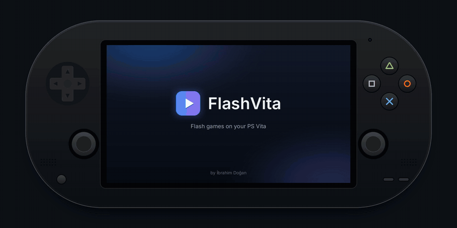
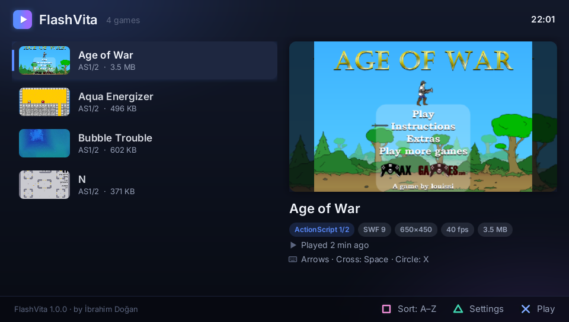
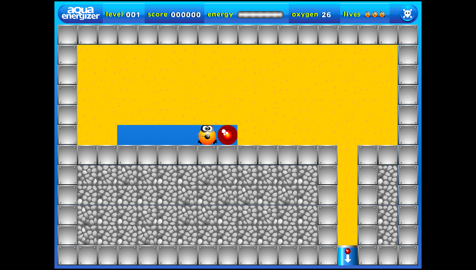
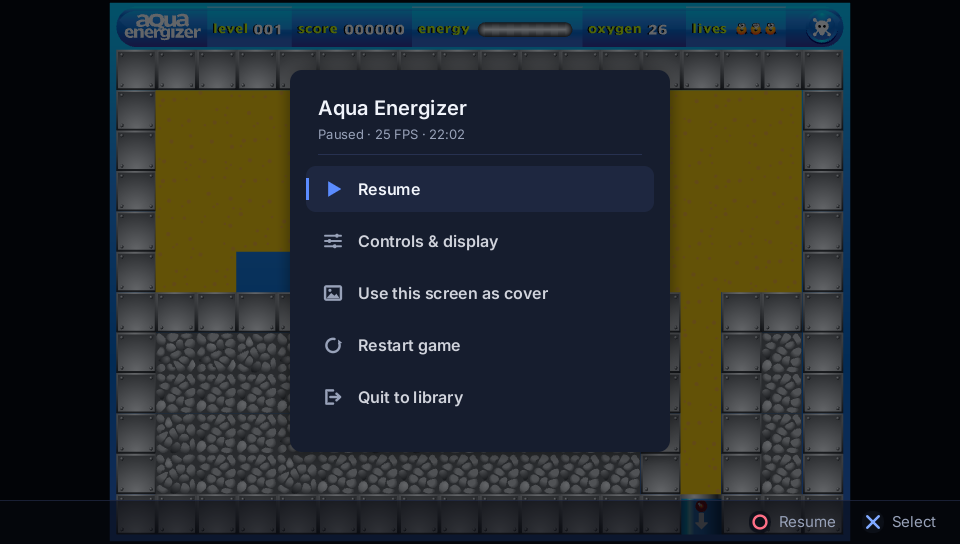
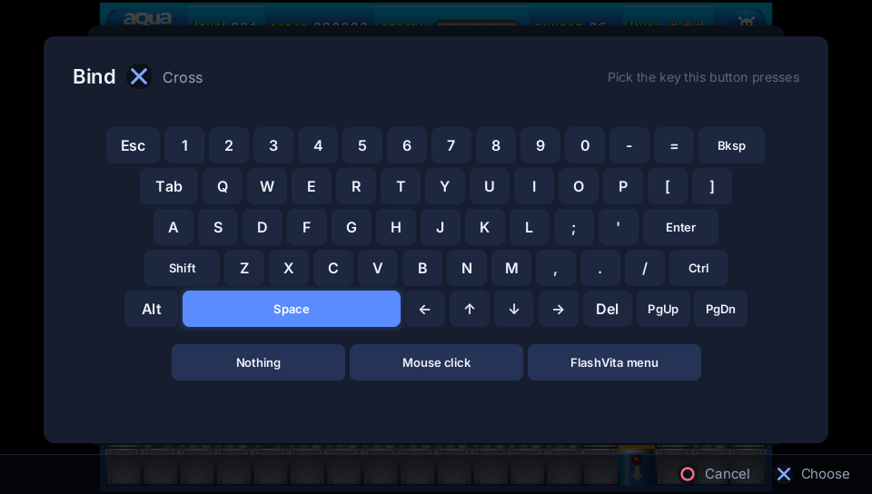
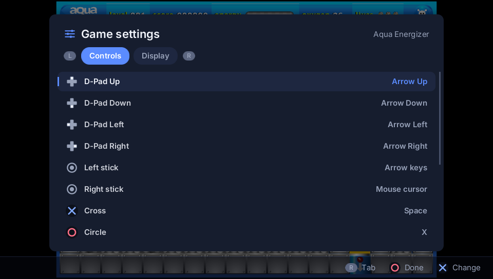
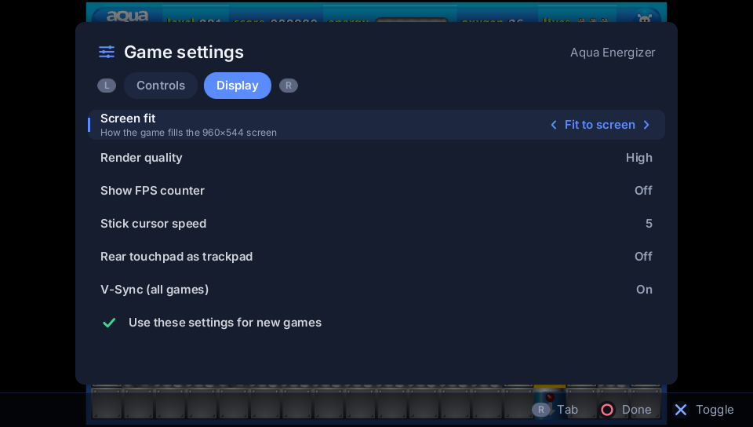

<div align="center">

# FlashVita

**Play Flash games on your PS Vita.**

A native Flash player for the PS Vita built on [Ruffle](https://ruffle.rs) — one VPK with a game library, touch controls, per-game button mapping and a pause menu.

Made by **İbrahim Doğan**

[**⬇ Download the latest VPK**](https://github.com/ibrahim-dogan/vita-flash-emulator/releases/latest)



<sub>[Watch the trailer in full quality (MP4)](docs/media/trailer.mp4)</sub>

</div>

## Screenshots

| Library | In game |
| :---: | :---: |
|  |  |
| **Pause menu** | **Button mapping** |
|  |  |
| **Controls** | **Display options** |
|  |  |

<sub>Captured from FlashVita's desktop development build, which runs the same code at the Vita's 960×544 resolution.</sub>

## Installation

You need a PS Vita (or PS TV) running HENkaku / Ensō and [VitaShell](https://github.com/TheOfficialFloW/VitaShell).

1. Download **`flashvita.vpk`** from the [latest release](https://github.com/ibrahim-dogan/vita-flash-emulator/releases/latest).
2. Copy it to your Vita and install it with VitaShell.
3. Create the folder **`ux0:data/FlashGames/`** and put your `.swf` files in it.
4. Launch **FlashVita** from the home screen.

### Where to put your games

```
ux0:data/FlashGames/
├── Age of War.swf                ← single-file games go straight in here
├── Bubble Trouble.swf
└── Aqua Energizer/               ← subfolders are fine (up to two levels deep)
    ├── Aqua Energizer.swf
    └── levels/                   ← extra files a game loads stay next to it
        ├── level1.txt
        └── ...
```

- The file name becomes the game's title in the library (underscores turn into spaces).
- Some games are split into several files, such as a loader plus the main SWF, level data or XML. Keep all of them in the same folder, as they came.
- Portal "loader" SWFs often try to download the real game from a website that no longer exists. FlashVita can't go online, so it looks for a file with the same name in the game's folder instead. If that file is missing, FlashVita tells you which one.
- Added games while FlashVita is open? Press **SELECT** in the library to refresh.

FlashVita keeps its own data in **`ux0:data/flashvita/`**: settings, per-game profiles, covers, game saves and `log.txt`.

## Controls

**Library:** D-pad/left stick to browse, ✕ to play, △ for game settings, □ to sort (recent / A–Z), L/R to page, SELECT to refresh. You can also tap a game to select it and tap again to play.

**In game (defaults, change them per game):**

| Vita | Sends |
| --- | --- |
| D-pad / left stick | Arrow keys |
| ✕ / ○ / □ / △ | Space / X / Z / C |
| L / R | Shift / mouse click |
| START | Enter |
| SELECT | FlashVita menu |
| Right stick | Mouse cursor |
| Front touch screen | Mouse (tap to click, drag to drag) |
| **L + R + START** | FlashVita menu (always works, whatever the bindings) |

Open **Game settings** from the library (△) or the pause menu. There you can bind any button to any key, a mouse click or the menu. Sticks can be arrows, WASD, mouse cursor or off. You can also change how the game fits the screen, the render quality, the FPS counter, the cursor speed and the rear touchpad (as a trackpad). **"Use these settings for new games"** makes the current setup your default.

## Features

- **Library with covers.** Covers are pulled from artwork inside each SWF, replaced by a screenshot once you've played for a bit, or set manually from the pause menu. The library also shows SWF details (ActionScript version, stage size, frame rate, file size) and play history.
- **Fast startup.** Games are read and unpacked on a background thread while an animated loading screen shows progress. SWF analysis is cached between runs.
- **Pause menu.** Resume, change settings with a live preview, set a cover, restart, or quit to the library. Game saves are written to the memory card when you pause.
- **Tuned for the Vita.** Frame pacing that follows the game's own frame rate (no busy looping), CPU at 444 MHz and GPU at 222 MHz, and a GLES2 renderer optimised for vitaGL.

## Compatibility and troubleshooting

FlashVita plays whatever [Ruffle](https://ruffle.rs/#compatibility) can play. Most ActionScript 1/2 games work well; ActionScript 3 support is good and improving. A few things aren't supported yet:

- **Blend modes:** Erase and Alpha, and the ones that need the background in a shader (overlay, difference, etc.), fall back to normal drawing.
- **Filters:** blur, glow and drop shadow aren't applied.
- **Hardware features:** Stage3D and embedded video.

**A game stays on its loading screen.** It is probably trying to download a file that isn't on your Vita. A message names the missing file; put it next to the game.

**Something looks wrong or FlashVita crashes.** Please [open an issue](https://github.com/ibrahim-dogan/vita-flash-emulator/issues) with the game's name and your `ux0:data/flashvita/log.txt`.

## Building from source

Everything builds in Docker (VitaSDK, SDL2 with the vitaGL backend, vitaGL, the Rust `armv7-sony-vita-newlibeabihf` target):

```bash
./build.sh        # → dist/flashvita.vpk
```

The first build compiles all of Ruffle with full LTO and takes a while. Pushing a `v*` tag builds the VPK on GitHub Actions and attaches it to a release.

**Desktop development build.** The app also runs on macOS/Linux at 960×544, which is much faster to iterate on:

```bash
cd emulator
FLASHVITA_GAMES=/path/to/swfs cargo run
```

On the desktop build, the keyboard stands in for the Vita:

| Key | Vita |
| --- | --- |
| Arrow keys | D-pad |
| X or Enter | ✕ |
| C or Esc | ○ |
| Z | □ |
| V | △ |
| Q / E | L / R |
| Space | START |
| Tab | SELECT |
| Mouse | Front touch screen |

`FLASHVITA_SCRIPT` automates input for screenshots and recordings (`wait`, `sleep`, `press`, `hold`, `tap`, `shot`, `rec`/`stoprec`, `quit`).

The LiveArea artwork is rendered by the app itself (`FLASHVITA_RENDER_ASSETS=/tmp/art cargo run`, then `python3 tools/make_livearea.py /tmp/art`). `tools/vita_frame.py` draws the Vita frame used in this README.

### Project layout

| Path | What |
| --- | --- |
| `emulator/src/main.rs` | App state machine and frame loop |
| `emulator/src/session.rs` | A running game: Ruffle player and input mapping |
| `emulator/src/screens/` | Library, loading, pause menu, settings, key picker |
| `emulator/src/ui/` | Batched 2D renderer (font atlas, SDF icons) and theme |
| `emulator/src/worker.rs` | Background thread: movie loading, SWF analysis, covers |
| `emulator/src/swfinfo.rs` | Fast SWF header parsing and cover extraction |
| `emulator/ruffle_render_glow/` | GLES2 Ruffle renderer tuned for vitaGL |
| `emulator/patches/jpeg-decoder/` | Single-threaded JPEG decoding on the Vita |

## Credits

- **İbrahim Doğan**: FlashVita (app, UI, input mapping, library, renderer work)
- [Ruffle](https://github.com/ruffle-rs/ruffle): the Flash Player emulator at the core
- [Fancy2209/ruffle4consoles](https://github.com/Fancy2209/ruffle4consoles): the original Ruffle-on-Vita glue this project started from
- [Rinnegatamante](https://github.com/Rinnegatamante): vitaGL and vitaShaRK
- [Northfear/SDL](https://github.com/Northfear/SDL): SDL2 with the vitaGL backend
- [vita-rust](https://github.com/vita-rust): Rust toolchain for the Vita
- [Inter](https://rsms.me/inter/): UI font (SIL Open Font License)

Flash games shown in the media belong to their respective authors. PlayStation and PS Vita are trademarks of Sony Interactive Entertainment. This project is not affiliated with Sony.
