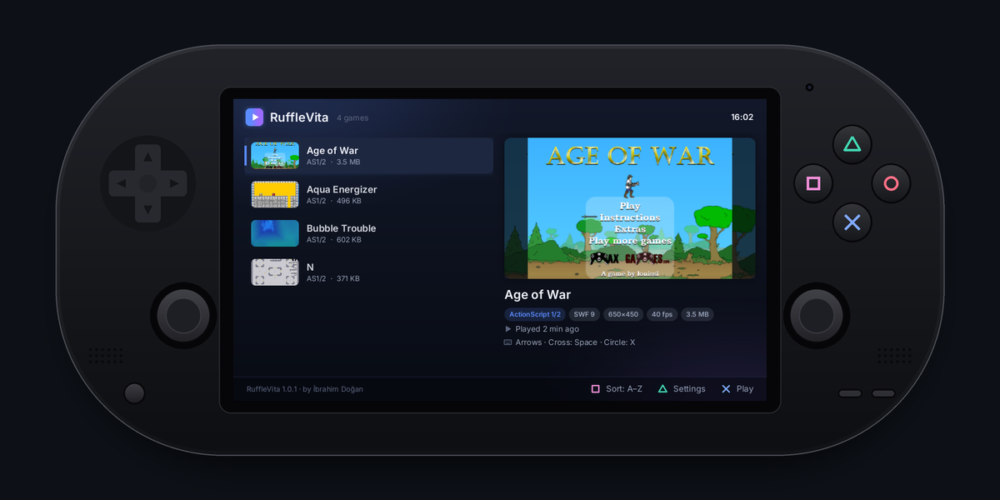
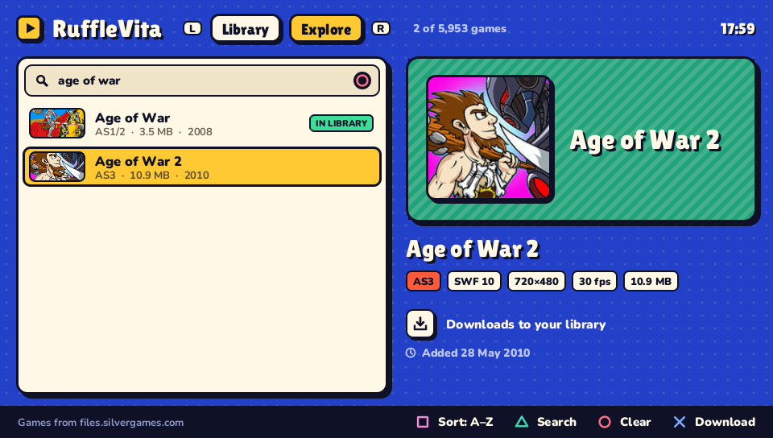
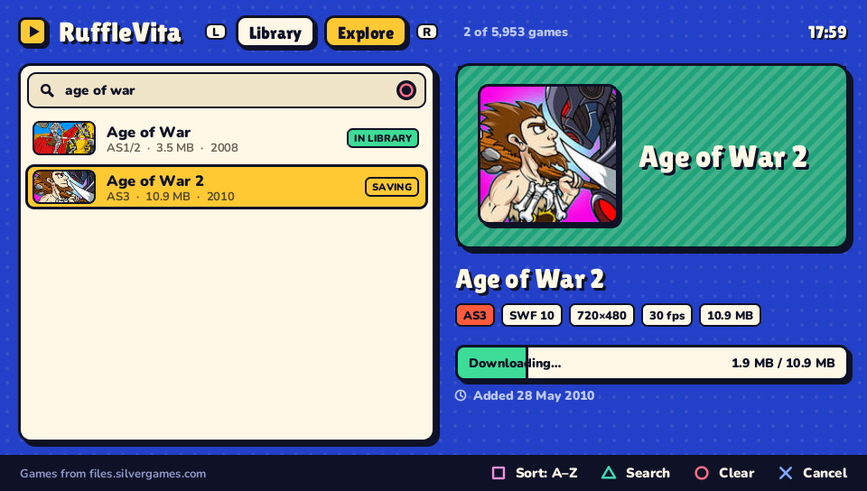

<div align="center">

# RuffleVita

**Play Flash games on your PS Vita.**

A native Flash player for the PS Vita built on [Ruffle](https://ruffle.rs) — one VPK with a game library, an Explore tab to find and download games over Wi-Fi, touch controls, per-game button mapping and a pause menu.

Made by **İbrahim Doğan**

[**⬇ Download the latest VPK**](https://github.com/ibrahim-dogan/vita-flash-emulator/releases/latest)



</div>

## Screenshots

| Library | Explore |
| :---: | :---: |
|  |  |
| **Downloading** | **In game** |
|  |  |
| **Pause menu** | **Button mapping** |
|  |  |
| **Controls** | **Display options** |
|  |  |

<sub>Captured from RuffleVita's desktop development build, which runs the same code at the Vita's 960×544 resolution.</sub>

## Installation

You need a PS Vita (or PS TV) running HENkaku / Ensō and [VitaShell](https://github.com/TheOfficialFloW/VitaShell).

1. Download **`rufflevita.vpk`** from the [latest release](https://github.com/ibrahim-dogan/vita-flash-emulator/releases/latest).
2. Copy it to your Vita and install it with VitaShell.
3. Create the folder **`ux0:data/FlashGames/`** and put your `.swf` files in it.
4. Launch **RuffleVita** from the home screen.

### Where to put your games

```
ux0:data/FlashGames/
├── Age of War.swf                ← single-file games go straight in here
├── Bubble Trouble.swf
└── Aqua Energizer/               ← subfolders are fine (up to two levels deep)
    ├── Aqua Energizer.swf
    └── levels/                   ← extra files a game loads stay next to it
        ├── level1.txt
        └── ...
```

- The file name becomes the game's title in the library (underscores turn into spaces).
- Some games are split into several files, such as a loader plus the main SWF, level data or XML. Keep all of them in the same folder, as they came.
- Portal "loader" SWFs often try to download the real game from a website that no longer exists. Games can't go online, so RuffleVita looks for a file with the same name in the game's folder instead. If that file is missing, RuffleVita tells you which one.
- Added games while RuffleVita is open? Press **SELECT** in the library to refresh.

RuffleVita keeps its own data in **`ux0:data/rufflevita/`**: settings, per-game profiles, covers, game saves, the Explore catalog and `log.txt`.

### Finding games in Explore

Press **R** in the library to open **Explore**: about 6,000 Flash games from the [Silvergames](https://www.silvergames.com) archive at `files.silvergames.com/flash/`. It needs Wi-Fi.

- The catalog downloads the first time you open Explore and is saved on the memory card; it refreshes once a week, or when you press **SELECT**.
- Press **△** to search with the Vita's keyboard and **○** to clear the search. **□** sorts by name, newest or smallest.
- Rest on a game for a moment and RuffleVita reads its first 16 KB to show its ActionScript version, stage size and frame rate before you download it. Only about one in six games still has cover art on Silvergames; the rest get a cover made from their name.
- **✕** downloads the game into `ux0:data/FlashGames/`, where it shows up in the library. **✕** again cancels the download, and on a game you already have it starts playing.
- Games over 20 MB are marked as large: some won't fit in the Vita's memory.

### Coming from FlashVita 1.0.0

Version 1.0.0 was released as FlashVita. RuffleVita installs as a new app next to it. The first time it starts, it copies your settings, per-game profiles, game saves and covers from `ux0:data/flashvita/`, so you can pick up where you left off. After that you can delete the old FlashVita bubble and, once you're happy, the `ux0:data/flashvita/` folder. Your games stay in `ux0:data/FlashGames/`.

## Controls

**Library:** D-pad up/down (or the left stick) to browse, left/right to page, ✕ to play, △ for game settings, □ to sort (recent / A–Z), SELECT to refresh, **L/R to switch between Library and Explore**. You can also tap a game to select it and tap again to play.

**Explore:** the same, with △ to search, ○ to clear the search, □ to sort, ✕ to download (or cancel, or play) and SELECT to refresh the catalog.

**In game (defaults, change them per game):**

| Vita | Sends |
| --- | --- |
| D-pad / left stick | Arrow keys |
| ✕ / ○ / □ / △ | Space / X / Z / C |
| L / R | Shift / mouse click |
| START | Enter |
| SELECT | RuffleVita menu |
| Right stick | Mouse cursor |
| Front touch screen | Mouse (tap to click, drag to drag) |
| **L + R + START** | RuffleVita menu (always works, whatever the bindings) |

Open **Game settings** from the library (△) or the pause menu. There you can bind any button to any key, a mouse click or the menu. Sticks can be arrows, WASD, mouse cursor or off. You can also change how the game fits the screen, the render quality, the physics speed, the FPS counter, the cursor speed and the rear touchpad (as a trackpad). V-Sync and **Dark mode** (for RuffleVita's own menus) apply to all games. **"Use these settings for new games"** makes the current setup your default.

## Features

- **Explore.** Browse, search and download about 6,000 games from the Silvergames Flash archive, with each game's details read before you download it.
- **Library with covers.** Covers are pulled from artwork inside each SWF, replaced by a screenshot once you've played for a bit, or set manually from the pause menu. The library also shows SWF details (ActionScript version, stage size, frame rate, file size) and play history.
- **Fast startup.** Games are read and unpacked on a background thread while an animated loading screen shows progress. SWF analysis is cached between runs.
- **Pause menu.** Resume, change settings with a live preview, set a cover, restart, or quit to the library.
- **Saves.** Each game keeps its saves in its own folder, `ux0:data/rufflevita/saves/<Game> [id]/`. They are written when you pause or quit, and every 30 seconds while you play.
- **Works offline.** Many games call web services that are long gone (Kongregate, MindJolt, ad and score servers). RuffleVita answers the common portal APIs itself and keeps a game running when a missing service would otherwise stop it.
- **Dark mode.** A dark theme for the library, Explore and settings.
- **Tuned for the Vita.** Frame pacing that follows the game's own frame rate (no busy looping), CPU at 444 MHz and GPU at 222 MHz, and a GLES2 renderer optimised for vitaGL.

## Compatibility and troubleshooting

RuffleVita plays whatever [Ruffle](https://ruffle.rs/#compatibility) can play. Most ActionScript 1/2 games work well; ActionScript 3 support is good and improving. A few things aren't supported yet:

- **Blend modes:** Erase and Alpha, and the ones that need the background in a shader (overlay, difference, etc.), fall back to normal drawing.
- **Filters:** blur, glow and drop shadow aren't applied.
- **Hardware features:** Stage3D and embedded video.

**A game runs slowly.** The Vita's CPU is many times slower than a PC's, and Ruffle runs ActionScript without a JIT, so heavy ActionScript 3 games can drop to low frame rates. The Box2D physics engine and the Alternativa3D engine are compiled ahead of time, which makes Happy Wheels about twice as fast and speeds up 3D games such as 3D Taxi Racing. For physics games, **Physics speed: Fast** in the game's settings trades a little accuracy for more speed. Turn on the FPS counter in the game's settings to see where the time goes: `tick` is the game's own code, `render` and `present` are drawing.

**A game stays on its loading screen.** It is probably trying to download a file that isn't on your Vita. A message names the missing file; put it next to the game.

**Something looks wrong or RuffleVita crashes.** Please [open an issue](https://github.com/ibrahim-dogan/vita-flash-emulator/issues) with the game's name and your `ux0:data/rufflevita/log.txt`.

## Building from source

Everything builds in Docker (VitaSDK, SDL2 with the vitaGL backend, vitaGL, the Rust `armv7-sony-vita-newlibeabihf` target):

```bash
./build.sh        # → dist/rufflevita.vpk
```

The first build compiles all of Ruffle with full LTO and takes a while. Pushing a `v*` tag builds the VPK on GitHub Actions and attaches it to a release.

**Desktop development build.** The app also runs on macOS/Linux at 960×544, which is much faster to iterate on:

```bash
cd emulator
RUFFLEVITA_GAMES=/path/to/swfs cargo run
```

On the desktop build, the keyboard stands in for the Vita:

| Key | Vita |
| --- | --- |
| Arrow keys | D-pad |
| X or Enter | ✕ |
| C or Esc | ○ |
| Z | □ |
| V | △ |
| Q / E | L / R |
| Space | START |
| Tab | SELECT |
| Mouse | Front touch screen |

`RUFFLEVITA_SCRIPT` automates input for screenshots and recordings (`wait`, `sleep`, `press`, `hold`, `tap`, `type` (with `_` for spaces), `enter`, `shot`, `rec`/`stoprec`, `quit`).

The LiveArea artwork is rendered by the app itself (`RUFFLEVITA_RENDER_ASSETS=/tmp/art cargo run`, then `python3 tools/make_livearea.py /tmp/art`). `tools/vita_frame.py` draws the Vita frame used in this README.

### Project layout

| Path | What |
| --- | --- |
| `emulator/src/main.rs` | App state machine and frame loop |
| `emulator/src/session.rs` | A running game: Ruffle player and input mapping |
| `emulator/src/screens/` | Library, Explore, loading, pause menu, settings, key picker |
| `emulator/src/ui/` | Batched 2D renderer (font atlas, SDF icons) and theme |
| `emulator/src/worker.rs` | Background thread: movie loading, SWF analysis, covers |
| `emulator/src/catalog.rs` | The Explore catalog: listing parser, search, caches |
| `emulator/src/fetcher.rs`, `net.rs` | Network threads and a small HTTP client for Explore |
| `emulator/src/swfinfo.rs` | Fast SWF header parsing and cover extraction |
| `emulator/ruffle_render_glow/` | GLES2 Ruffle renderer tuned for vitaGL |
| `emulator/patches/ruffle/` | Ruffle's core with performance and memory fixes for the Vita |
| `emulator/patches/jpeg-decoder/` | Single-threaded JPEG decoding on the Vita |

## Credits

- **İbrahim Doğan**: RuffleVita (app, UI, input mapping, library, renderer work)
- [Ruffle](https://github.com/ruffle-rs/ruffle): the Flash Player emulator at the core
- [Fancy2209/ruffle4consoles](https://github.com/Fancy2209/ruffle4consoles): the original Ruffle-on-Vita glue this project started from
- [Rinnegatamante](https://github.com/Rinnegatamante): vitaGL and vitaShaRK
- [Northfear/SDL](https://github.com/Northfear/SDL): SDL2 with the vitaGL backend
- [vita-rust](https://github.com/vita-rust): Rust toolchain for the Vita
- [Lilita One](https://fonts.google.com/specimen/Lilita+One) by Juan Montoreano and [Nunito](https://github.com/googlefonts/nunito) by Vernon Adams, Cyreal and Jacques Le Bailly: UI fonts, with [Inter](https://rsms.me/inter/) for symbols (all SIL Open Font License)
- [Silvergames](https://www.silvergames.com): hosts the Flash archive Explore browses

Flash games shown in the media and offered in Explore belong to their respective authors; Explore downloads them from Silvergames' public archive, one at a time, the way a browser would. PlayStation and PS Vita are trademarks of Sony Interactive Entertainment. RuffleVita is an independent project and is not affiliated with Sony, the Ruffle project or Silvergames.
